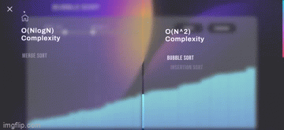
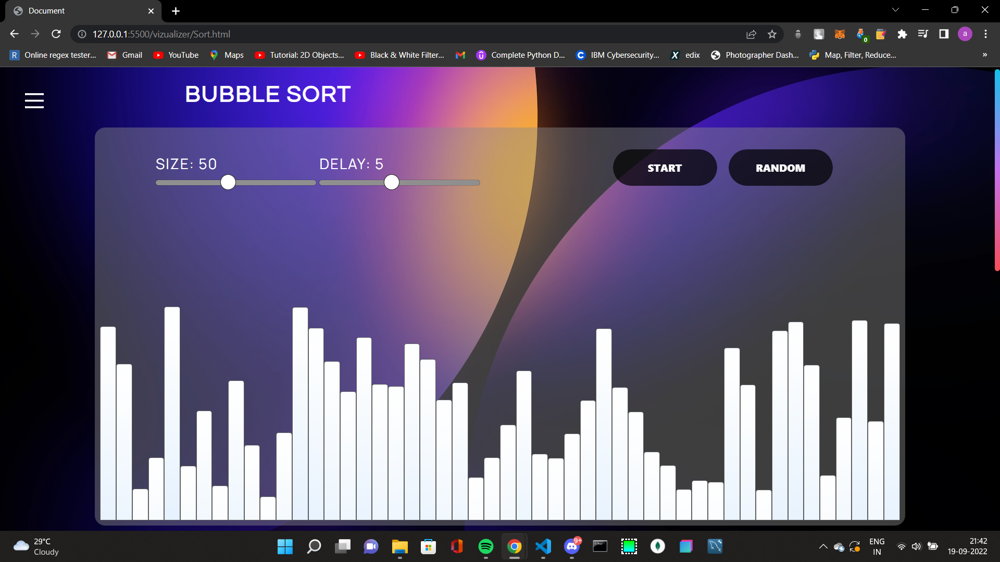
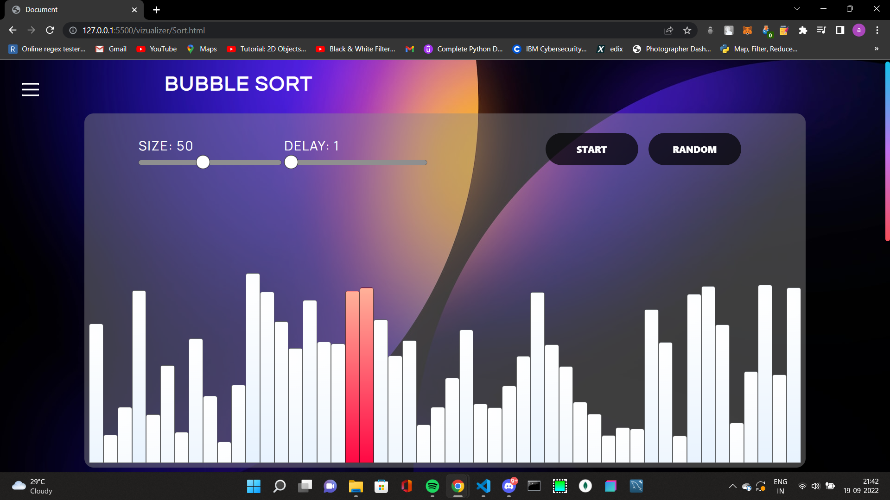
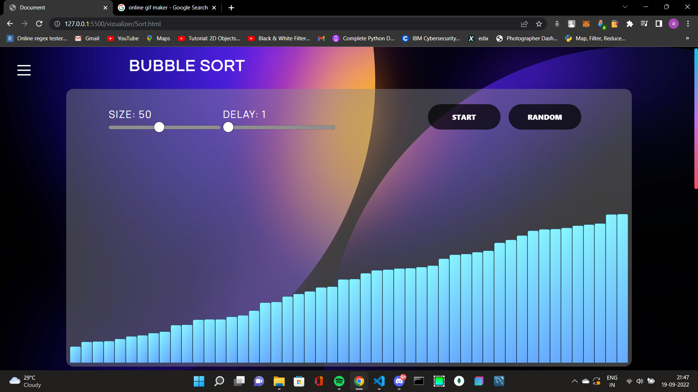

# Sorting Visualizer

**Sorting Visualizer** is web app for visualizing a bunch of sorting algorithms like :

- Merge Sort
- Heap Sort
- Bubble sort
- Selection Sort
- Insertion Sort
- Quick sort

It has got various functionalities like **Delay Controls ⌛** (_Processing Delay Control_) and **Size Controls 📏** (_Array Size Controls_), showcasing **time and space complexities** and **code** for the following algorithm.

# Working of the Web app

Here in our web app one can select an sorting algorithm from the menu . Then you can select on the size of the element and the Delay of the algorithm to play. You can click on **Random** buttom in order to generate a newly random array. Then in order to start the sorting click on the **Start** Buttom . While sorting is happening the size and speed range will be disabled .

# Screenshot

